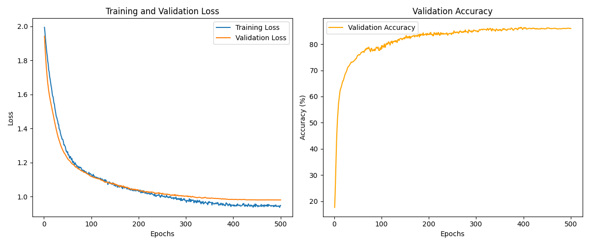
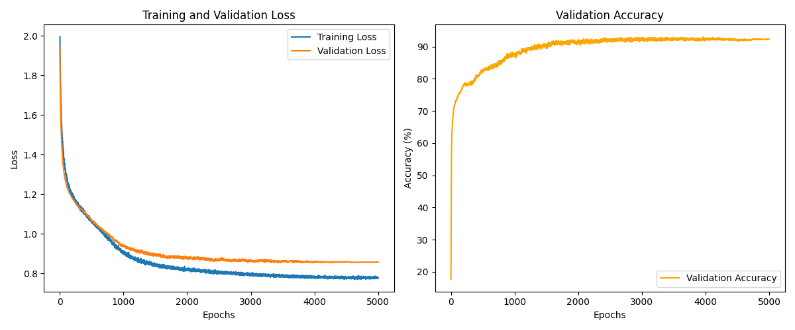
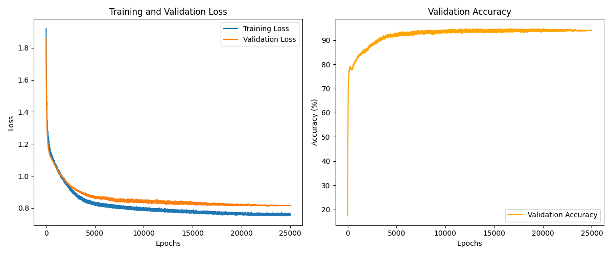
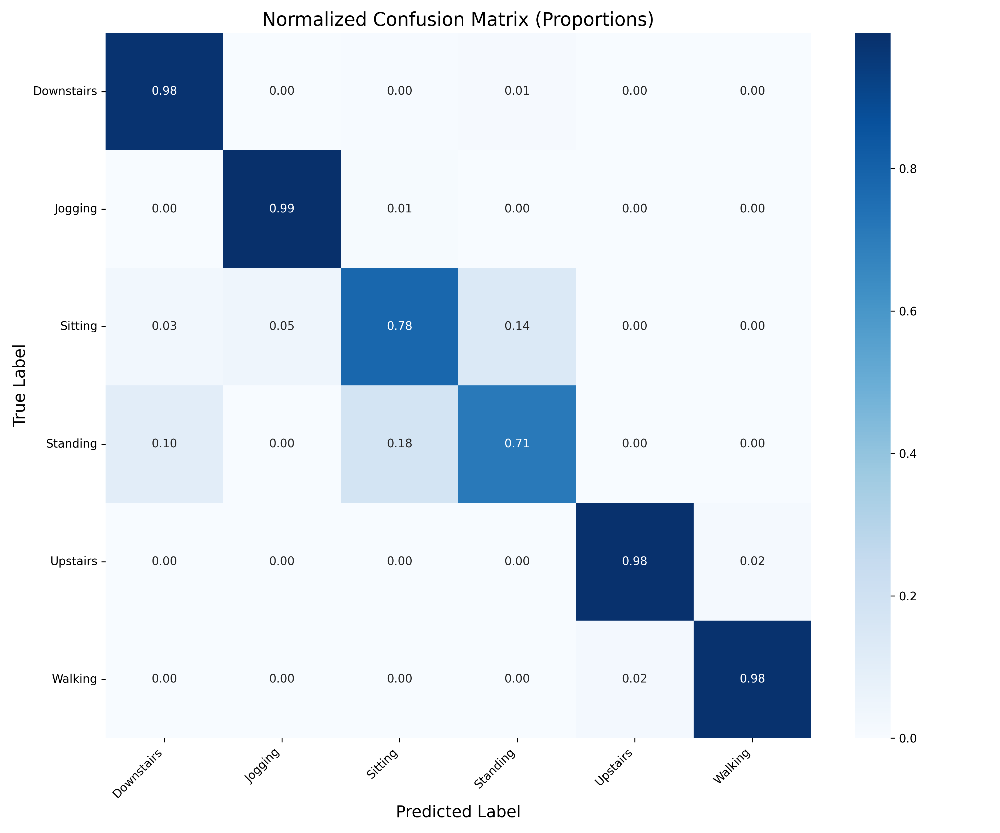

# Human Activity Recognition using Smartphone Sensors (WISDM) - Small MLP
[](https://www.python.org/)
[](https://opensource.org/licenses/MIT)

## Overview
This project implements an end-to-end pipeline for Human Activity Recognition (HAR) using the WISDM dataset. It includes data preprocessing and splitting, exploratory analysis, hyperparameter tuning (via Optuna), and training of a lightweight Multi-Layer Perceptron (MLP) achieving **94.33% test accuracy** with a 74K parameter model.

**Despite running for 25,000 epochs, the model's small size (~74k parameters) allows it to train in just a few minutes on consumer-grade hardware, making experimentation highly accessible. The impact of changes in model architecture can be seen after training for only ~100-1000 epochs.**

## Key Features
- Handles sparse ARFF format parsing without external Weka dependencies.
- Implements stratified train/validation/test splits to preserve class distribution.
- Supports class-weighting to handle severe data imbalance (Class 5 is only 4.5% of the entire dataset).
- Hyperparameter tuning with Optuna.
- Reproducible training with configurable YAML files.

## Results
| Metric | Value | Original Paper Values |
| :--- | :--- | :--- |
| **Test Accuracy** | **94.33%** | 91.7% |
| **Macro F1-Score** | 90.7% | --- |
| **Weighted F1-Score** | 93.2% | --- |
| **Model Parameters** | 72,454  (~0.28 MB) | --- |

## Methodology

The WISDM dataset was split into training, validation, and test sets using a 60/20/20 stratified split to preserve the original class distribution across all subsets. 

The model architecture is a lightweight Multi-Layer Perceptron (MLP) with three hidden layers. To mitigate overfitting, dropout layers and L2 weight decay were incorporated. The hyperparameters (learning rate, dropout rate, hidden layer sizes, and weight decay coefficient) were optimized using Optuna to maximize validation accuracy.

### Training Dynamics & Convergence
An interesting empirical observation emerged during training: the model exhibited a **slow but steady decrease in validation loss** well beyond the typical convergence point. While initial tests suggested 5,000 epochs as a practical cutoff, extending training to **25,000 epochs** yielded a **~4% absolute improvement in test accuracy**—from 90.19% to the final 94.33%—without any signs of overfitting (training and validation losses continued to decrease in tandem), despite reaching a decreased rate of improvement beyond 1k epochs.

Attempts to accelerate convergence by increasing the learning rate proved destabilizing, and the inclusion of batch or layer normalization did not mitigate this instability. This suggests that the optimization landscape for this specific architecture and dataset is particularly flat, requiring a high number of gradient steps to reach a flatter minimum. The final model checkpoint was selected as the one achieving the lowest validation loss after 25,000 epochs.

<h4>500 Epochs</h4>


<h4>5,000 Epochs</h4>


<h4>25,000 Epochs</h4>


## Interpretation
The model fit to the training data, while maintaining good generalization across unseen examples.
The model had difficulty distinguishing stationary activities (i.e. Sitting and Standing) having only ~70% accuracy.
Remaining activities, that required much more intense and specific movements, had all accuracies **>98%**
Increasing the model size and depth gave marginal improvements in accuracies, while extending the length of the training gave a  small but steady gains. 



> **Note:** While state-of-the-art (SOTA) on WISDM reaches ~99%, this project focuses on delivering a clean, reproducible, and lightweight baseline suitable for resource-constrained devices, serving as a strong foundation for further experimentation.

## Future Work
- Experiment with different model architectures.
- Implement data augmentation.
- Improve LR scheduling, increasing minimal LR to improve performance in long runs.

## Installation & Usage
1. Clone the repository:
   ```
   git clone https://github.com/metalCrate/WISDM-HAR.git
   cd human-activity-recognition
2. ```
   pip install -r requirements.txt
3. Download the dataset from https://www.cis.fordham.edu/wisdm/dataset.php. Put in data/raw so that the final directory looks like: data/raw/WISDM_ar_v1.1/...
4. ```
   python main.py
   ```
## Citation

> Kwapisz, J. R., Weiss, G. M., & Moore, S. A. (2010). Activity Recognition using Cell Phone Accelerometers. In *Proceedings of the Fourth International Workshop on Knowledge Discovery from Sensor Data (at KDD-10)*. Washington DC.

**Dataset:** WISDM Activity Prediction Dataset (v1.1), Wireless Sensor Data Mining (WISDM) Lab, Fordham University.